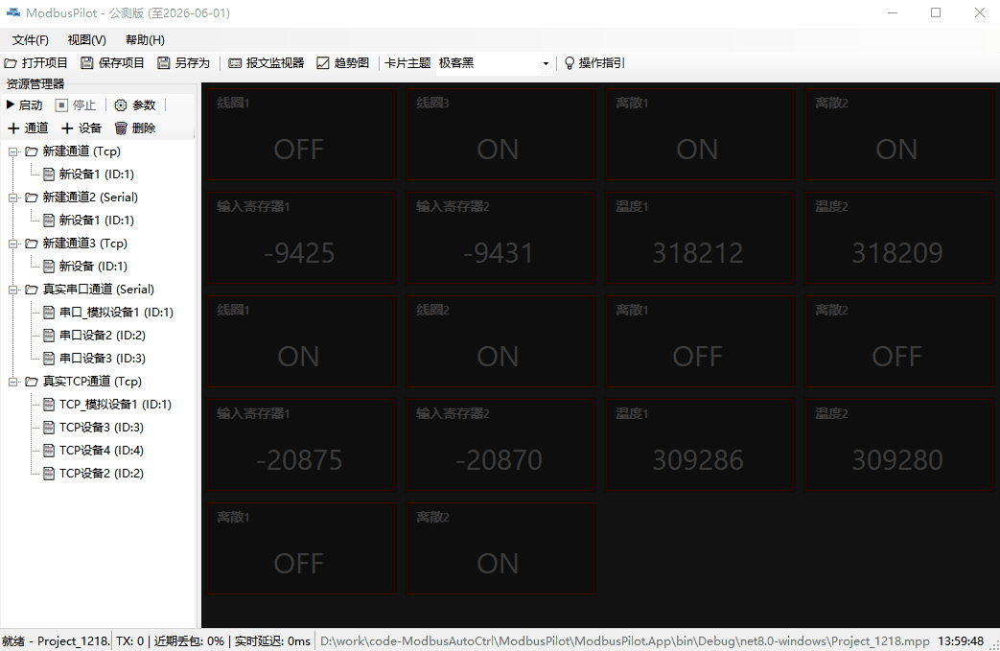
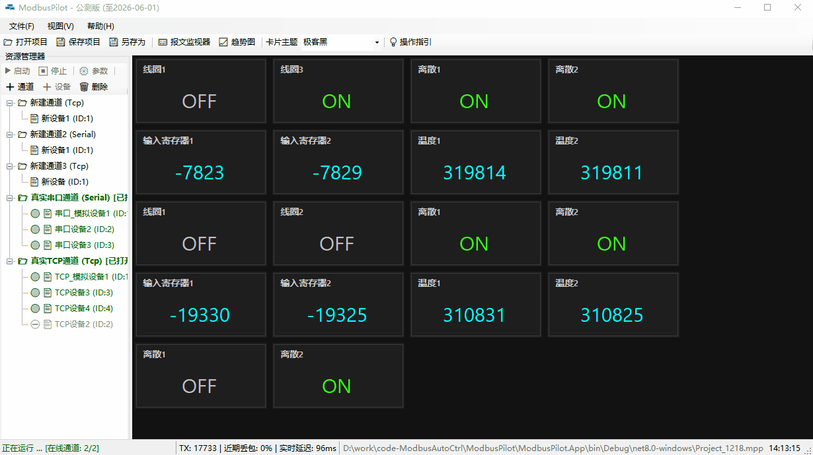
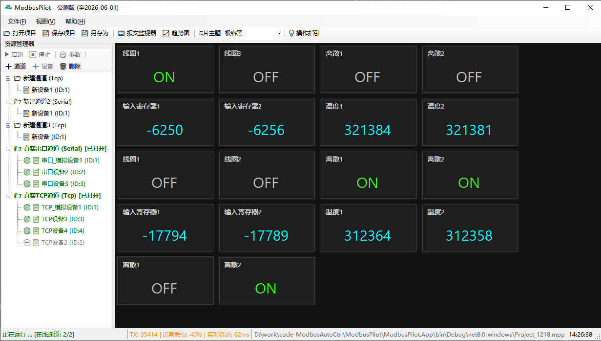
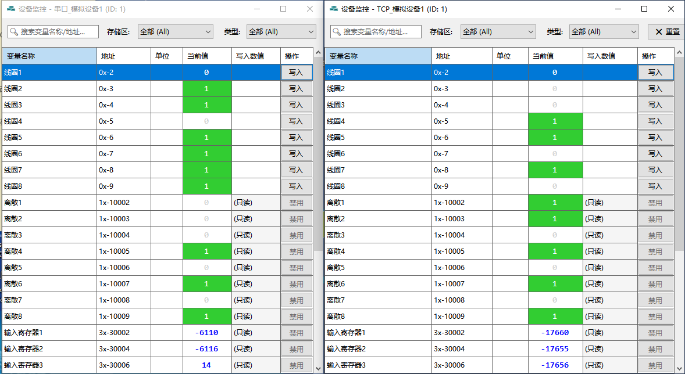
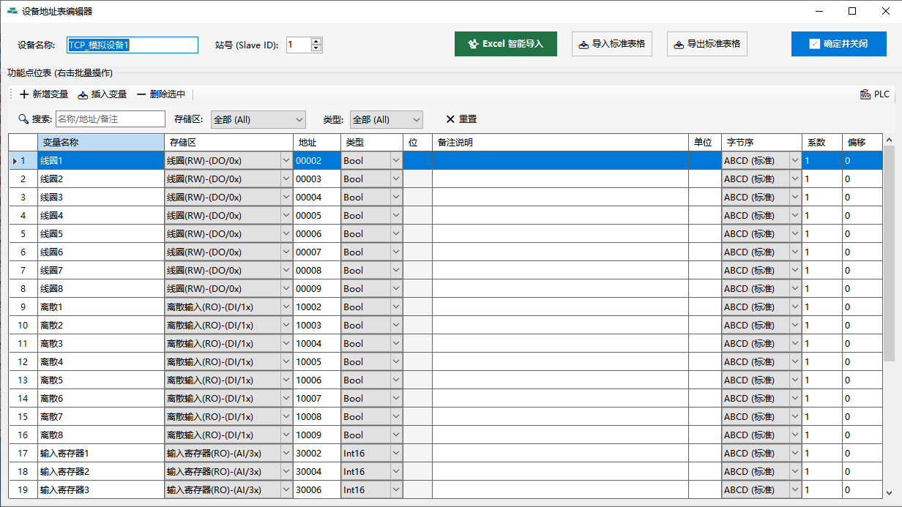
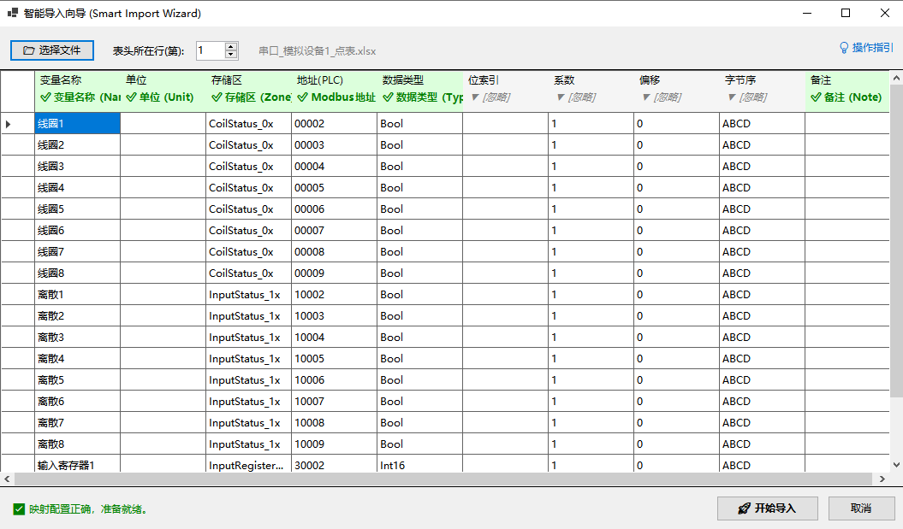
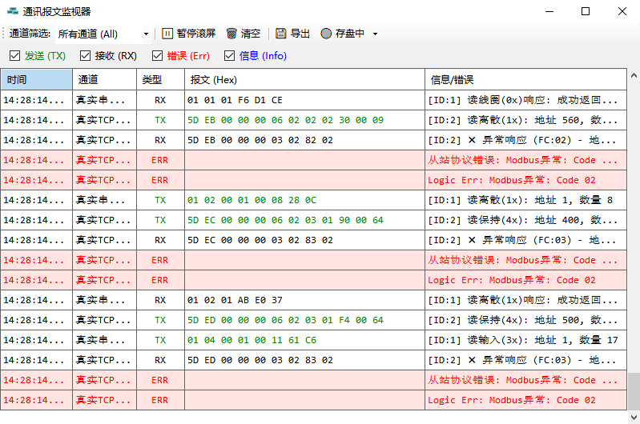
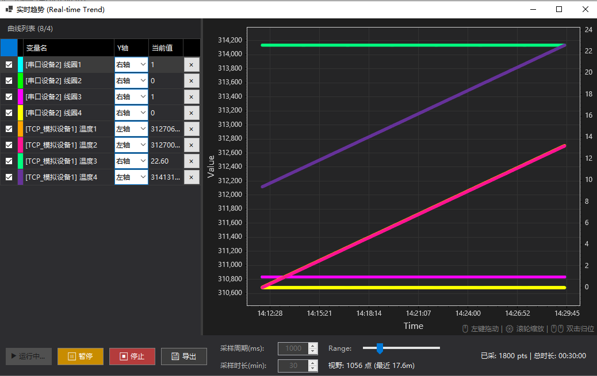

# 🚀 ModbusPilot(Modbus调试工具、Modbus监控工具-主站)

> [🇨🇳 中文](README.md) | [🇬🇧 English](README.en.md)

> **告别”上古时代”的调试体验。**
>
> 专为工控人打造的 .NET 8 现代化 Modbus 调试与监控利器。
>
> *Designed by Zerosys Lab*

> ⚠️ **使用须知**：ModbusPilot 是面向开发者与自动化工程师的**调试/测试/配置工具**，并未经过认证，不适用于工业安全系统、生命关键系统或生产环境下的关键控制。在此类场景使用需自行承担风险，详见文末《免责声明》。

---

## ⚡ 为什么选择 ModbusPilot？

你是否厌倦了传统 Modbus 调试工具那仿佛来自 Windows 98 的灰暗界面？
**ModbusPilot** 不仅仅是一个调试助手，它更是一个**轻量级的桌面组态终端**。基于高性能 **.NET 8** 架构，我们重新定义了数据交互的方式——让数据不仅“可见”，而且“好看”、“好用”。

---

## ⚡ 界面预览 (Dashboard)

**👇 30秒带你体验现代化调试 **

*(图注：实时监控界面，报文监控与 变量趋势查看)*

---

## ✨ 全能特性 (Full Features)

### 1. 🌐 多通道与多设备拓扑 (Topology)
打破单连接限制，构建完整的现场网络。
*   **混合架构**：支持在同一个项目中同时运行 Modbus TCP、RTU (串口) 通道。
*   **多设备轮询**：单通道下支持挂载多个从站设备 (Slave ID)，软件自动调度轮询队列，互不干扰。
*   **虚拟设备**：支持创建离线虚拟设备用于界面布局测试。

### 2. ⚡ 变量批量导入与智能生成
不再浪费时间手动敲几百个地址。
*   **Excel/CSV 互通**：支持从 Excel 直接导入点表，自动识别地址、数据类型与描述。
*   **变量批量操作**：输入起始地址（如 `40001`）和数量（如 `50`），一键批量生成连续变量，配置效率提升 10 倍。

### 3. 🎴 沉浸式卡片监控 (Card View)
拒绝枯燥的 Excel 表格模式！
*   **可视化看板**：将枯燥的寄存器地址映射为现代化的**数据卡片**。
*   **拖拽组态**：支持开关、数显、输入控制等多种控件，所见即所得。
*   **状态映射**：自动将 `0/1` 转换为 `运行/停止` 并配以红绿指示灯，一目了然。

### 4. 📈 实时趋势图监控 (Real-time Trends)
捕捉瞬间的数据波动。
*   **示波器级体验**：可拖拽任意数值型变量，右键即可开启**毫秒级趋势曲线**。
*   **多轴对比**：支持将多个变量（如温度、压力、设定值）拖入同一图表进行关联分析，轻松定位 PID 震荡问题。

### 5. 🩺 报文监控与自动写入
既是显微镜，也是手术刀。
*   **全量日志**：内置高性能十六进制日志记录器，自动解析功能码与异常码（Exception Code）。
*   **自动化存储**：支持全量日志或错误日志自动存储，方便回溯错误情况。

### 6. 💾 项目快照与标准导出 (Project Management)
不仅是调试工具，更是资产管理库。
*   **工程文件 (.mpilot)**：一键保存当前所有通道、设备、变量配置及界面布局。下次去现场，3秒恢复工作环境。
*   **标准化导出**：支持将经过验证的变量点表导出为标准 Excel/CSV 格式，方便交付给上位机或 PLC 工程师复用。

---

## 📥 下载与安装

### 🖥️ 运行环境 (System Requirements)
> **✅ 完美支持 Windows 10 / 11 (x64/x86)**
> *   **兼容性**：经测试支持 Windows 10 (1809+), Win11, 以及 **Win10 Enterprise LTSC** 长期支持版。
> *   **硬件要求**：任意双核 CPU，500MB 内存即可流畅运行（极低占用）。

### 🚀 安装步骤
**本软件为绿色免安装版 (Portable)，不写注册表，无残留。已完全开源免费，不再区分专业版/免费版，全部功能开放。**

1.  进入 [👉 **发行版 (Releases)**](https://gitee.com/ZerosysLab/ModbusPilot/releases) 页面。
2.  下载最新的独立版压缩包（`ModbusPilot_vX.Y.Z_Win64.zip`）。
3.  解压到任意文件夹（建议非 C 盘）。
4.  双击 `ModbusPilot.exe` 即可起飞！

> **💡 说明**：发行包为独立版（已内置 .NET 8 运行时），电脑无需单独安装 .NET 8 即可直接运行。

---

## 📚 文档与支持
详细的操作指南、接线图示及故障排查，请参阅：
👉 **[ModbusPilot 用户手册 (UserGuide.md)](./UserGuide.md)**

## 🛠️ 开发环境
*   Visual Studio 2022
*   .NET 8.0 SDK (Windows Forms)
*   **开源/反馈**：欢迎提交 [Issues](https://gitee.com/ZerosysLab/ModbusPilot/issues) 反馈 Bug 或建议。

## ⚠️ 免责声明
ModbusPilot 是一款**调试与配置工具**，并非经过认证的工业级 SCADA/控制系统。本软件按"原样"提供，不提供任何形式的明示或暗示保证。

- **禁止用于安全关键或生命关键场景**：请勿将本软件用于可能因故障导致人身伤亡或重大财产/环境损害的设备控制（如医疗设备、核能、航空航天、武器系统等）。
- **未经工业生产级认证**：如用于监控或写入真实工业/商业设备，请务必先充分离线测试，并自行承担相应后果。
- 作者与贡献者不对因使用本软件而产生的任何损害、停机、数据丢失或业务中断承担责任。

使用本软件即表示您同意以上条款。完整法律条款请见 [LICENSE](../../LICENSE)（MIT 协议）。

---
**Copyright © 2026 Zerosys Lab.**

## ⚡ 界面预览 (Interface Preview)

### 1. 🖥️ 现代化 Modbus 调试主界面 (Dashboard)
基于 .NET 8 构建的高性能上位机界面。支持 **Modbus TCP/RTU 多通道并发**，集成了拖拽式组态看板，让调试不再面对枯燥的原始数据，而是可视化的仪表盘。

### 2. 📊 多设备实时监控 (Device Monitor)
替代传统的 Modbus Poll。支持**多从站 (Multi-Slave) 并发轮询**，实时监控保持寄存器 (4x)、线圈 (0x) 等全存储区状态。支持 **Float/Double/Long** 等复杂数据类型的自动解析与大小端切换。

### 3. ⚙️ 点位管理与地址映射 (Tag Management)
专业的地址表配置工具。支持设置 **线性变换 (Scale/Offset)**，可直接将 PLC 的原始数值转换为物理量（如温度、压力）。支持设置读写权限，防止误操作。

### 4. ⚡ Excel 智能导入 (Smart Import)
工程效率神器！支持 **Excel/CSV 点表一键导入**，不限模板格式，智能识别列名。支持批量生成连续地址变量，拒绝手动重复录入，适合数千点位的大型项目调试。

### 5. 🩺 报文分析与故障诊断 (Packet Analyzer)
内置报文级 **串口/网络抓包工具**。实时显示 Tx/Rx 原始十六进制数据 (Hex)，自动解析 **功能码 (Function Code)** 与 **异常码 (Exception Code)**，是排查通讯超时、CRC 校验错误的强力辅助。

### 6. 📈 实时趋势示波器 (Real-time Trend)
不仅仅是调试器，更是数据记录仪。支持选中任意数值变量开启 **毫秒级实时曲线**，支持多轴对比分析，帮助工程师精准捕捉 PID 震荡与信号干扰。

