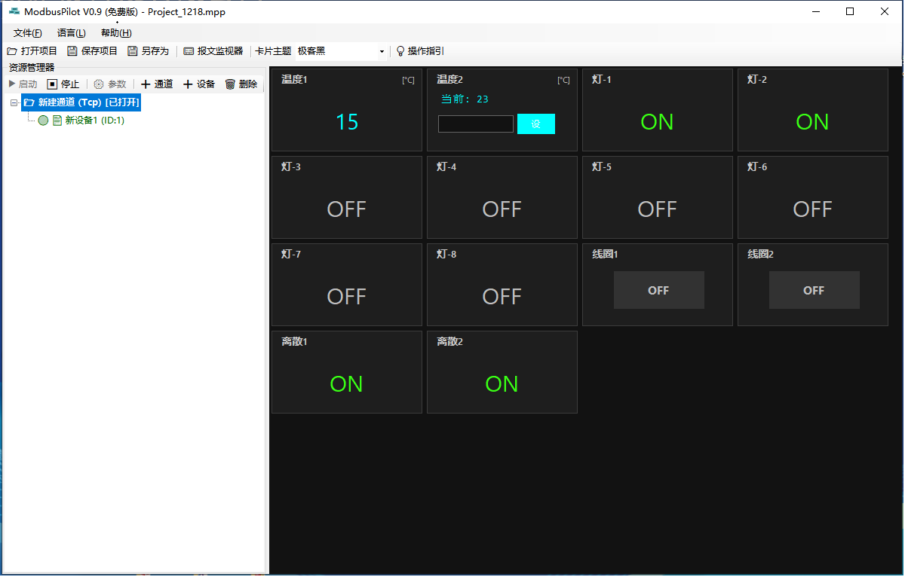
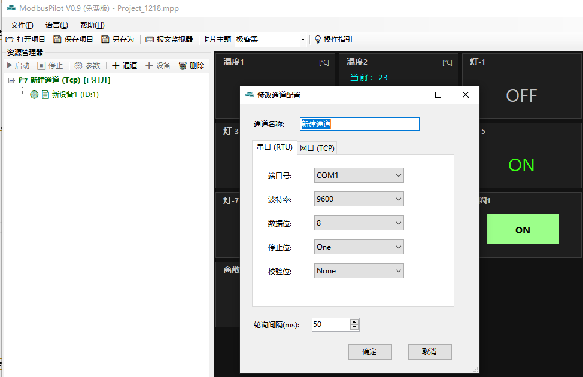
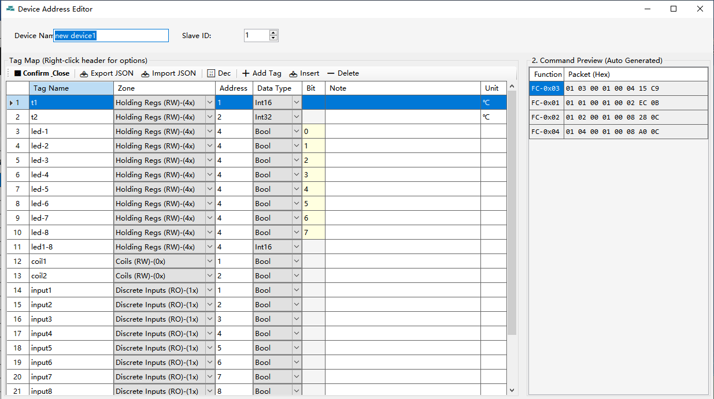
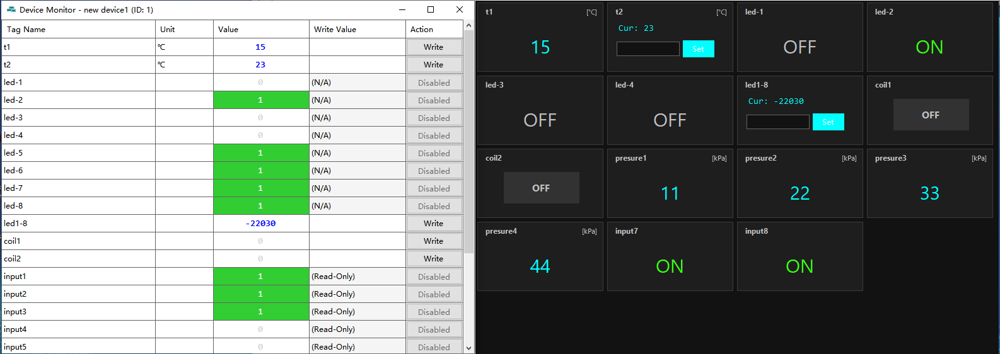

***

# 📖 ModbusPilot User Guide

> This document will guide you to quickly master the core features of ModbusPilot: Communication, Configuration, and Drag-and-Drop Dashboard creation.

---

## 1. Quick Connection

### 1.1 Create Channel
ModbusPilot uses a **"Channel -> Device -> Point"** hierarchy.
1.  Click `➕ Channel` in the left **Resource Explorer** toolbar (or right-click the root node).
2.  Select the communication mode in the popup window:
    *   **Serial (RTU)**: Select COM port, Baud Rate, and other parameters.
    *   **Ethernet (TCP)**: Enter target IP and Port (default 502).
3.  Click OK, and a new channel node will appear in the tree menu.

### 1.2 Add Device
1.  Select the channel created in the previous step.
2.  Click `➕ Device` in the toolbar (or right-click the channel node).
3.  Set the **Slave ID** and Device Name.
    *   *Note: Slave IDs under the same channel must be unique.*

### 1.3 Start Communication
Select a channel or device node, then click `▶ Start` in the toolbar.
*   🟢 **Green Dot**: Communication Normal.
*   🔴 **Red Dot**: Communication Timeout or Error (Please check wiring or firewall).

---

## 2. Address Configuration (Point Mapping)

Right-click a **Device Node** -> Select **“⚙️ Config”** to enter the Address Table Editor.

*   **Add Tag**: Click `➕ Add Tag` and enter the Modbus address in the grid.
*   **Parameter Details**:
    *   **Zone**: Supports 0x (Coils), 1x (Discrete Inputs), 3x (Input Registers), 4x (Holding Registers).
    *   **Data Type**: Supports Bool, Int16, UInt16, Float, Double, etc.
    *   **Advanced Settings**: Right-click the table header to enable **“Byte Order”** and **“Linear Scale (Factor/Offset)”** columns.
*   **Command Preview**: The right panel automatically generates the corresponding Modbus Hex packets. Double-click to copy.

> 💡 **Tip**: Supports copying data from Excel or using `Export JSON` to backup configuration.

---

## 3. Visual Dashboard

This is the core feature of ModbusPilot, allowing you to create monitoring dashboards without writing any code.

### 3.1 Drag & Drop Creation
1.  Ensure points (tags) have been added to the device.
2.  Expand the device in the left tree to find specific **Tag Nodes**.
3.  Hold the left mouse button and **Drag** the tag to the blank area on the right.
4.  Release the mouse. The system will automatically generate a widget based on the point type:
    *   **Monitor**: Applicable to all types.
    *   **Switch**: Applicable to 0x Coils.
    *   **Control**: Applicable to 4x Registers.

### 3.2 Widget Operations
*   **Remove**: Right-click the widget -> `Remove Widget`.
*   **Write**: For control widgets, enter a value and click the `Set` button to send the command.

---

## 4. Other Features

*   **Language Switching**: Menu `Language(L)` -> Select `English` or `简体中文`.
*   **Theme Switching**: Select `Cyberpunk`, `Industrial`, etc., from the toolbar dropdown.
*   **Traffic Monitor**: Click `📟 Traffic Monitor` in the toolbar to view raw Tx/Rx data. Supports filtering by channel and exporting logs.

---

## ❓ FAQ

**Q: Why does the device show red (offline)?**
A: Please check: 1. Is physical wiring loose? 2. Does the Slave ID match? 3. (TCP Mode) Does the target firewall allow port 502?

**Q: Float data parsing is incorrect?**
A: Modbus floating-point numbers have various byte orders. Please enter the Device Configuration and try changing the **“Byte Order”** of the point (e.g., change ABCD to CDAB).

**Q: The value changes automatically after writing?**
A: If a Linear Scale (Factor/Offset) is configured, the software automatically performs precision correction. This is normal behavior.