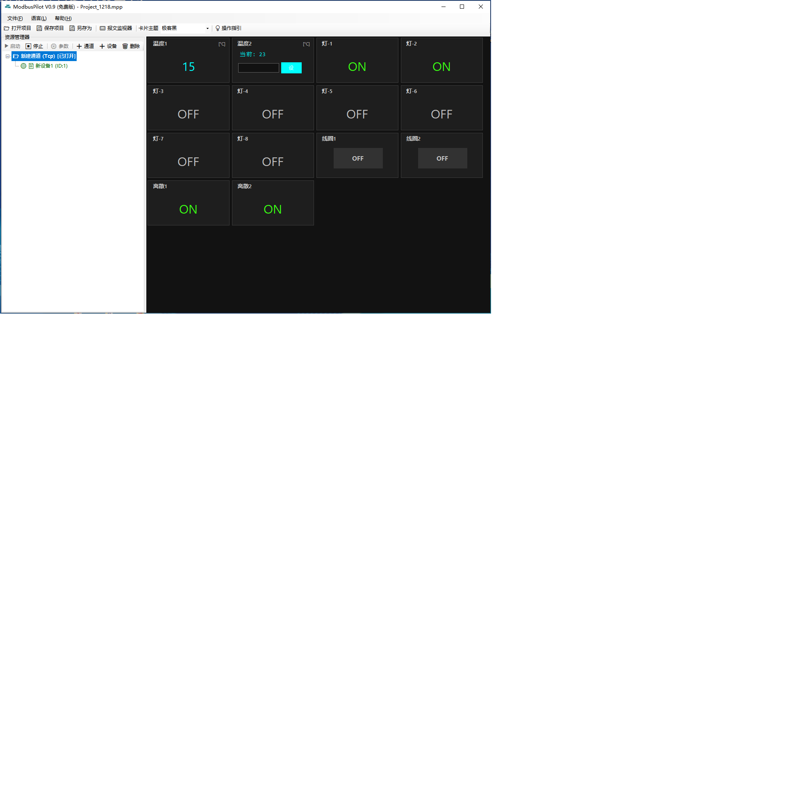
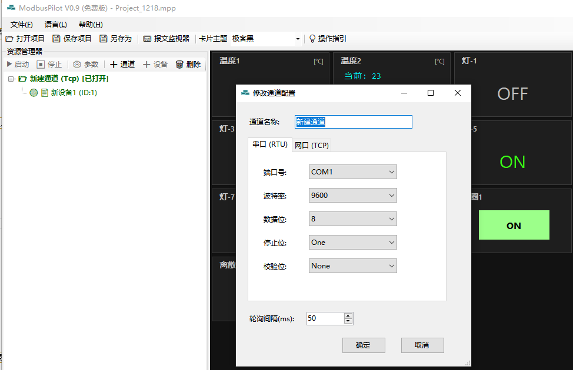
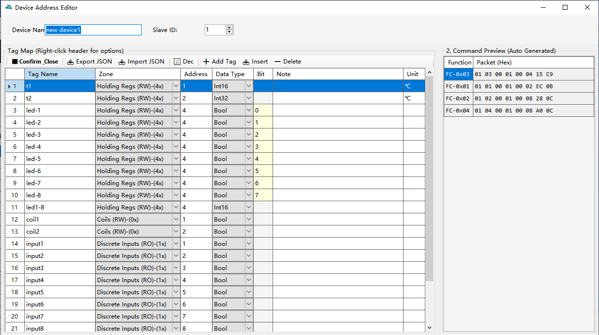
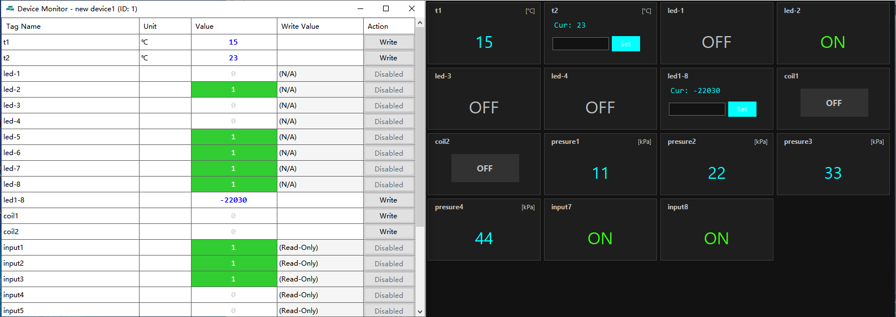

# 📖 ModbusPilot 使用手册

> 本文档将指导您快速掌握 ModbusPilot 的核心功能：通讯、配置与拖拽组态。

---

## 1. 快速连接 (Connection)

### 1.1 创建通道 (Channel)
ModbusPilot 使用 **“通道 -> 设备 -> 点位”** 的层级结构。
1.  在左侧 **资源管理器** 工具栏点击 `➕ 通道` (或右键根节点)。
2.  在弹出的窗口中选择通讯方式：
    *   **串口 (RTU)**: 选择 COM 口、波特率等参数。
    *   **网口 (TCP)**: 输入目标 IP 和端口 (默认 502)。
3.  点击确定，树形菜单将出现新的通道节点。

### 1.2 添加设备 (Device)
1.  选中刚才创建的通道。
2.  点击工具栏 `➕ 设备` (或右键通道节点)。
3.  设置 **站号 (Slave ID)** 和设备名称。
    *   *注意：同一通道下的站号必须唯一。*

### 1.3 启动通讯
选中通道或设备节点，点击工具栏的 `▶ 启动`。
*   🟢 **绿色圆点**: 通讯正常。
*   🔴 **红色圆点**: 通讯超时或错误 (请检查接线或防火墙)。

---

## 2. 点位配置 (Address Mapping)

右键点击 **设备节点** -> 选择 **“⚙️ 修改配置”**，进入地址表编辑器。

*   **新增变量**: 点击 `➕ 新增变量`，在表格中输入 Modbus 地址。
*   **参数详解**:
    *   **存储区**: 支持 0x(线圈), 1x(离散输入), 3x(输入寄存器), 4x(保持寄存器)。
    *   **数据类型**: 支持 Bool, Int16, UInt16, Float, Double 等。
    *   **高级设置**: 右键点击表头，可开启 **“字节序 (Byte Order)”** 和 **“线性变换 (Scale/Offset)”** 列。
*   **指令预览**: 右侧会自动生成对应的 Modbus 报文 Hex，双击可复制。

> 💡 **提示**: 支持从 Excel 复制数据，或使用 `导出 JSON` 功能备份配置。

---

## 3. 可视化组态 (Dashboard)

这是 ModbusPilot 的核心功能，无需编写代码即可创建监控看板。

### 3.1 拖拽创建 (Drag & Drop)
1.  确保设备已添加了点位。
2.  在左侧树中展开设备，找到具体的 **变量节点**。
3.  按住鼠标左键，将变量 **拖拽** 到右侧空白区域。
4.  松开鼠标，系统会自动根据点位类型生成卡片：
    *   **数值监视**: 适用于所有类型。
    *   **开关控制**: 适用于 0x 线圈。
    *   **数值写入**: 适用于 4x 寄存器。

### 3.2 卡片操作
*   **移除**: 右键点击卡片 -> `移除卡片`。
*   **写入**: 对于控制型卡片，输入数值后点击 `设 (Set)` 按钮即可下发指令。

---

## 4. 其他功能

*   **多语言切换**: 菜单栏 `语言(L)` -> 选择 `English` 或 `简体中文`。
*   **主题切换**: 工具栏下拉框选择 `极客黑`、`工业灰` 等主题。
*   **报文监视**: 点击工具栏 `📟 报文监视器`，查看底层 Tx/Rx 原始数据，支持按通道筛选和导出日志。

---

## ❓ 常见问题 (FAQ)

**Q: 为什么设备显示红色离线？**
A: 请检查：1. 物理接线是否松动；2. 从站 ID 是否匹配；3. (TCP模式) 目标防火墙是否放行 502 端口。

**Q: 浮点数解析数据不对？**
A: Modbus 浮点数存在多种字节序。请进入设备配置，尝试修改该点位的 **“字节序”** (如 ABCD 改为 CDAB)。

**Q: 写入数值后自动变了？**
A: 如果配置了线性变换 (系数/偏移)，软件会自动进行精度修正，这是正常现象。