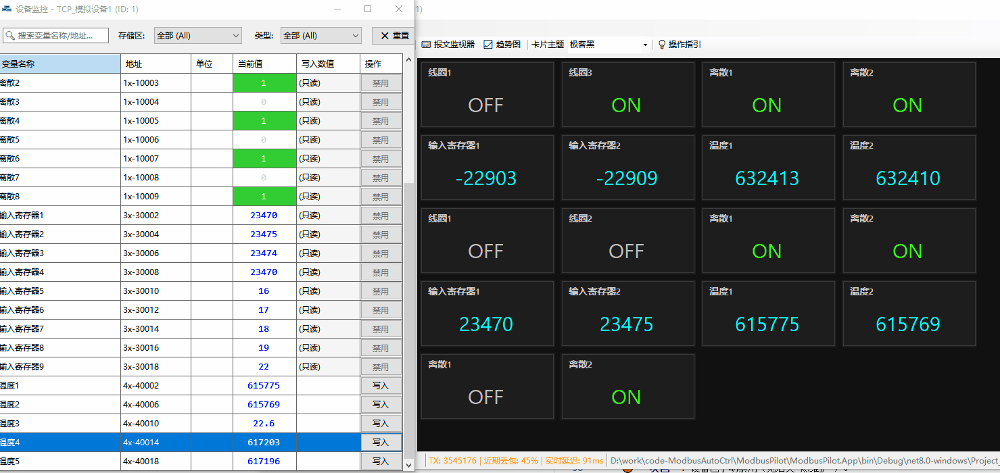

# 📘 ModbusPilot 使用手册 (User Guide)

> **适用平台**: Windows 10 / 11 (x64)

欢迎使用 **ModbusPilot**！这是一款基于 .NET 8 的现代化 Modbus 组态与调试工具，已完全开源免费。本手册将指导您从零开始，快速搭建一套可视化的设备监控系统。

> ⚠️ **注意**：ModbusPilot 是一款调试/测试/配置工具，并非经过认证的工业控制或 SCADA 系统，请勿用于安全关键或生产环境的关键控制场景。使用前请阅读 [README.md](README.md) 中的免责声明。

---

## 1. 快速连接 (Connection)

### 1.1 创建通道 (Channel)
ModbusPilot 采用 **“通道 -> 设备 -> 点位”** 的三层拓扑结构。
1.  点击左上角工具栏的 **[➕ 添加通道]**。
2.  **选择通讯模式**：
    *   **Modbus TCP**: 适用于网口设备。输入目标 IP（如 `192.168.1.5`）和端口（默认 `502`）。
    *   **Modbus RTU**: 适用于串口/485设备。选择 COM 口、波特率、数据位、校验位。
    *   *提示：波特率与校验位必须与物理设备完全一致，否则无法通讯。*

### 1.2 添加设备 (Device)
1.  在左侧树状菜单中，选中刚才创建的通道。
2.  点击工具栏 **[➕ 添加设备]**。
3.  **设置站号 (Slave ID)**：
    *   Modbus 协议规定每个设备的 ID 必须唯一（范围 1~247）。
    *   *注意：同一通道下不能出现重复的 ID。*

### 1.3 启动通讯
选中通道或设备节点，点击工具栏的 **[▶ 启动]**。
*   🟢 **绿色**: 通讯正常，数据实时刷新。
*   🔴 **红色**: 通讯超时。请检查接线、防火墙或从站 ID 设置。
*   ⛔ **灰色**: 设备已手动禁用（见后文“热维护”）。

---

## 2. 点位配置与批量导入 (Configuration)

右键点击 **设备节点** -> 选择 **“⚙️ 修改配置”**，进入点位管理界面。

### 2.1 基础配置
*   **存储区 (Zone)**:
    *   `0x Coil Status` (线圈，读写)
    *   `1x Input Status` (离散输入，只读)
    *   `3x Input Register` (输入寄存器，只读)
    *   `4x Holding Register` (保持寄存器，读写)
*   **数据类型**: 支持 Bool, Int16, UInt16, Float32, Int32 等。
*   **大小端 (Endian)**: 处理多字节数据（如浮点数）时，若数据乱码，请尝试切换 `ABCD` / `CDAB` 等格式。

---

### 2.2 ⚡ 智能导入与批量操作 (Smart Import & Batch Edit)
拒绝繁琐的手动录入，通过智能化工具实现“分钟级”万点配置。

1.  **智能 Excel 导入 (Flexible Import)**:
    *   **不限模板**: 彻底打破“必须使用固定模板”的限制。支持导入任意格式的 Excel 点位表（各类 PLC 或 HMI 导出的原始表格均可）。
    *   **自定义映射**: 在导入向导中，系统会自动识别列名。您也可以手动调整**“Excel列”**与**“软件属性”**（名称、地址、类型、区域、备注）的对应关系，实现无缝数据迁移。

2.  **批量快捷操作 (Batch Actions)**:
    *   **一键递增**: 选中多个变量，支持**地址自动递增**（如 `40001` 自动变为 `40001, 40002, 40003...`）以及**名称序列化**（如 `Temp_#` 自动变为 `Temp_1, Temp_2...`）。
    *   **批量属性修改**: 支持多选变量后，**统一修改**数据类型（如全选改为 `Float32`）、大小端格式、读写权限或备注信息，配置效率提升 10 倍。

---

## 3. 卡片式监控 (Dashboard)

这是 ModbusPilot 的核心亮点——**拖拽式组态看板**。

### 3.1 创建监控卡片
只需三步，即可将枯燥的数据转化为可视化卡片：
1.  **打开监视器**：在左侧资源树中，**双击** 设备名称，打开该设备的实时数据表格。
2.  **选择变量**：在表格中找到您需要上墙的变量行。
3.  **拖拽生成**：按住该行不放，直接 **拖拽 (Drag)** 到右侧灰色的仪表盘区域，松手即生成卡片。

### 3.2 卡片交互类型
系统会自动根据变量类型生成对应的卡片：
*   **🔢 数值监视 (Monitor)**: 适用于所有只读或读写变量，实时显示数值与单位。
*   **🔘 开关控制 (Switch)**: 专用于 `0x 线圈`。点击卡片上的拨杆，即可直接下发 `ON/OFF` 指令。
*   **✍️ 数值写入 (Write)**: 专用于 `4x 保持寄存器`。在卡片输入框中填写数值，点击发送即可修改设备参数。

### 3.3 布局调整与全屏
*   **自由布局**: 长按卡片头部标题栏，可随意**拖动位置**；右键点击卡片可进行**移除**或**编辑**。
*   **📺 沉浸式全屏**:
    *   **快捷键**: 按下键盘 `F11`。
    *   **鼠标操作**: 在仪表盘空白处 **右键 -> 进入全屏**。
    *   *说明: 全屏模式下将隐藏所有菜单栏与工具栏，提供纯净的监控体验，适合投屏展示。*

---

## 4. 进阶功能 (Advanced)

### 🔥 热维护 (Hot Maintenance)
**场景**: 当同一通道挂载了多个设备，其中一个设备断电或故障时，会导致整个通道轮询卡顿（等待超时）。
*   **操作**: 在左侧树状菜单中，**右键点击** 故障设备 -> 选择 **[⛔ 禁用此设备]**。
*   **效果**: 系统将跳过该设备，立即恢复其他正常设备的极速轮询。待设备修好后，再次右键启用即可。

### 📈 实时趋势图 (Trend Chart)
点击主界面工具栏的 **[📈 趋势分析]**。
*   **示波器模式**: 支持毫秒级数据采集。
*   **多轴对比**: 将温度、压力、设定值拖入同一图表，轻松分析 PID 波动或干扰源。

### 💾 项目保存与加载
*   **保存 (.mpp)**: 点击工具栏 **[💾 保存]**，将当前的通道配置、设备点表及仪表盘布局保存为工程文件。
*   **导出点表**: 在设备配置界面，支持将点位导出为标准 Excel/CSV 格式，方便交付。

---

## 5. 常见问题 (FAQ)

**Q: 为什么双击软件没反应？**
A: 请确认您下载的版本。如果是 **依赖版 (Dependent)**，需要先安装 [.NET 8 Runtime](https://dotnet.microsoft.com/download/dotnet/8.0)。推荐下载 **独立版 (Self-Contained)**，解压即用。

**Q: 连接成功，但一直是红色离线？**
A:
1.  **RTU**: 检查 A/B 线序是否接反？USB 转 485 驱动是否安装？
2.  **TCP**: 检查目标 IP 是否能 Ping 通？防火墙是否放行 502 端口？
3.  **通用**: 检查 **从站 ID (Slave ID)** 是否与设备实际设置一致？

**Q: 浮点数显示的数据不对（乱码）？**
A: 这是一个经典的“大小端”问题。请进入点位配置，修改该变量的 **字节序 (Byte Order)**（例如将 `ABCD` 改为 `CDAB` 或 `BADC`）。

**Q: 软件是免费的吗？**
A: 是的，ModbusPilot 已完全开源并永久免费（MIT 协议），不区分专业版/免费版，所有功能对所有用户开放。

---

**Copyright © 2026 Zerosys Lab.**